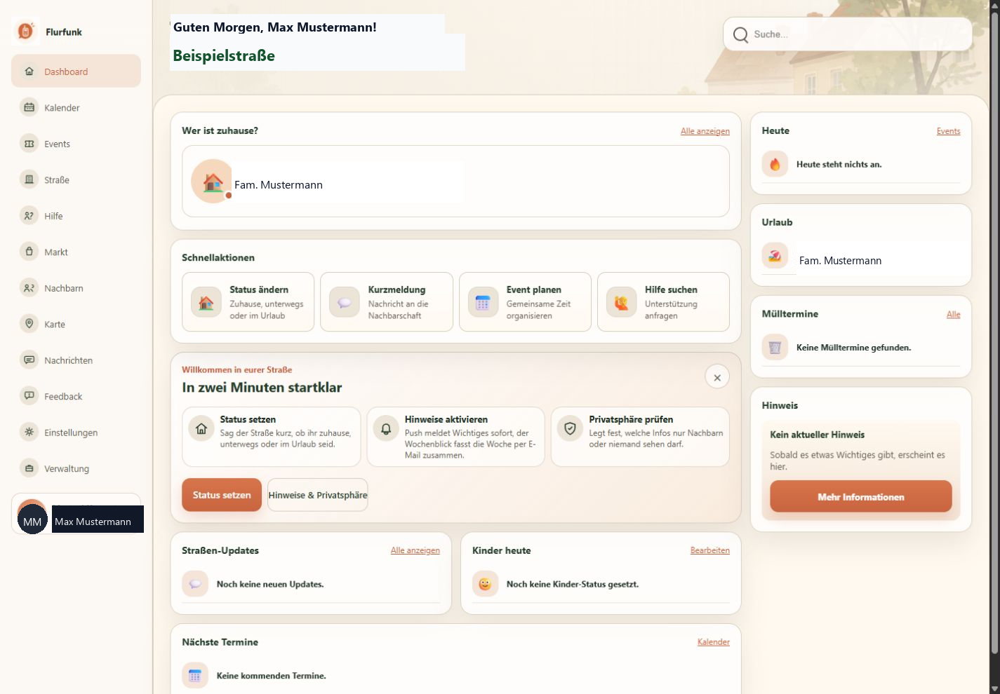
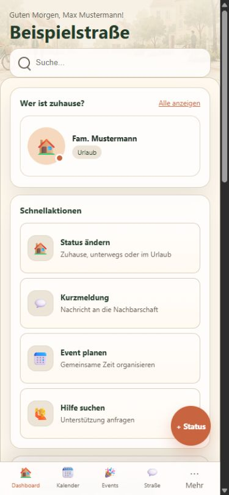
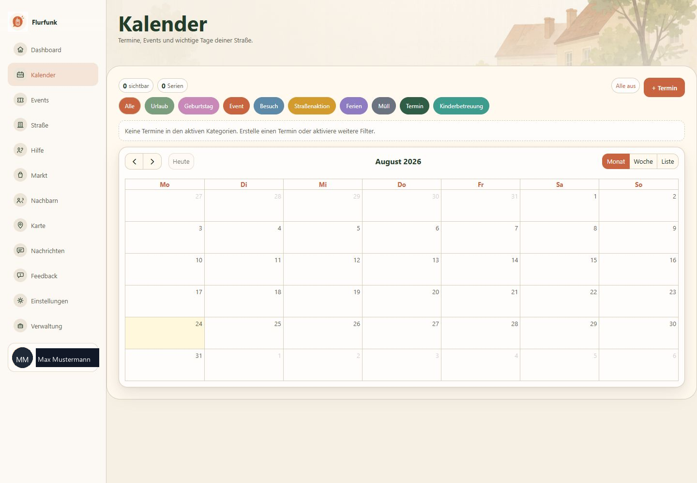
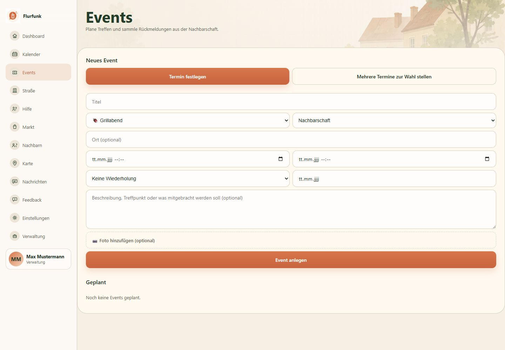
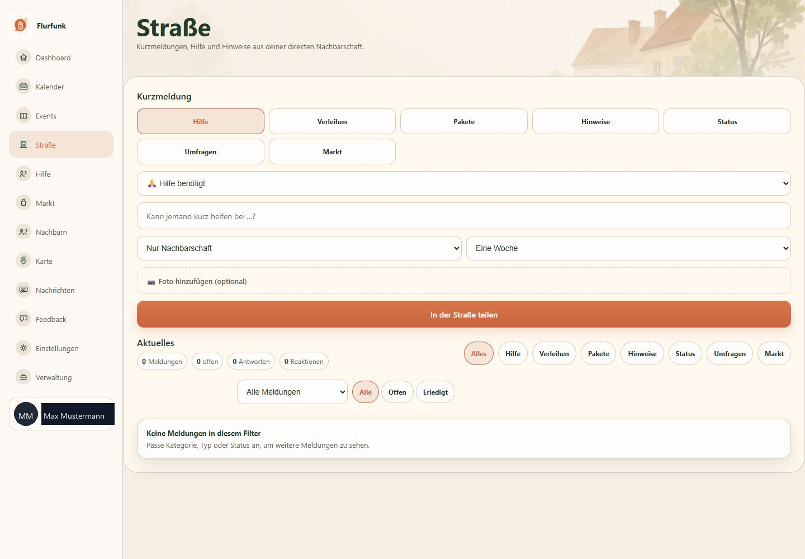
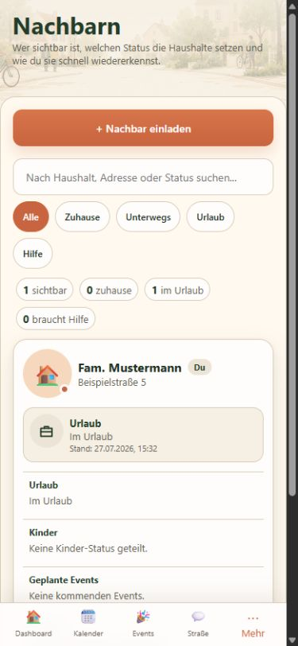

# Flurfunk


Neighborhood planning PWA for a single street or small local community.


Flurfunk is a React/Vite/TypeScript frontend with a small PHP 8 SQLite backend. It is designed for practical neighborhood coordination: registration by invitation code, local news/feed items, events, RSVP flows, child/family management, and a simple admin path for the first user.


Live target:


```text
https://www.red-it.org/apps/neighborhood/
```


The full product concept is documented in `PRD_Nachbarschafts-App.md`.

## Screenshots

The screenshots below use sanitized demo data such as `Max Mustermann`, `Fam. Mustermann`, and `Beispielstraße`.

### Dashboard



### Mobile Dashboard



### Calendar



### Events



### Street Feed



### Mobile Neighbors




## Why This Project Matters


This project shows how I build a complete small-business/community web app around realistic constraints:


- no separate database server required
- deployable to common PHP hosting
- SQLite persistence with automatic migrations
- PWA-friendly frontend structure
- clear separation between frontend build and backend API
- careful deployment process that preserves live SQLite data


## Tech Stack


- React + Vite
- TypeScript
- PHP 8.x
- SQLite
- Native PDO
- Atomic Design frontend structure
- Mini-MVC backend structure
- FTP/FTPS deployment script


## Product Scope


Implemented and connected to real API endpoints:


- registration with invitation code
- first user becomes admin automatically
- login
- dashboard
- street/community feed
- calendar list view
- child/family management
- events with RSVP


The planned v1.0 scope is described in `PRD_Nachbarschafts-App.md`, chapter 3. A dedicated settings/privacy page is still open.


## Architecture


```text
src/            React frontend
api/            PHP backend with core/controllers/models/migrations
public/         Static assets, PWA manifest, icons
scripts/        Deployment script and environment loader
.htaccess       SPA fallback for the frontend, excluding api/
```


Frontend structure follows Atomic Design:


```text
atoms -> molecules -> organisms -> templates -> pages
```


The backend is a small PHP Mini-MVC without Composer packages. SQLite is used as a single-file database, which is enough for the intended scope of one street with roughly 5-40 households.
